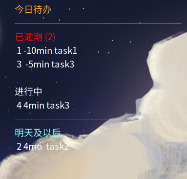

# TaskBoard-or-Ubuntu-Gnome
基于 TaskWarrior 和 Conky 实现的简易 TaskList
## 演示示例

## 安装使用:
```bash
curl -SLf https://raw.githubusercontent.com/ASGPIPO/TaskBoard-or-Ubuntu-Gnome/main/install.sh | bash
```
## 适用平台
Ubuntu 24.04LTS 
Gnome 桌面环境
